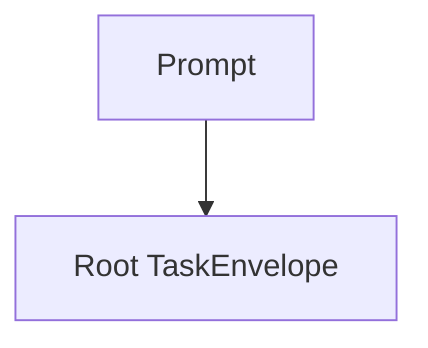
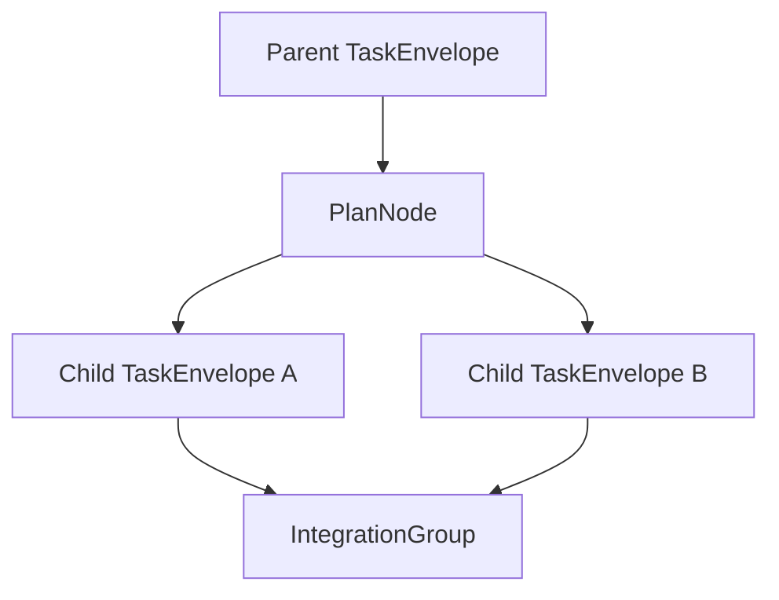
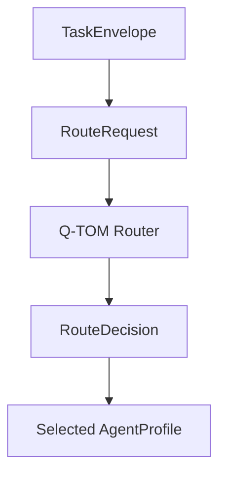
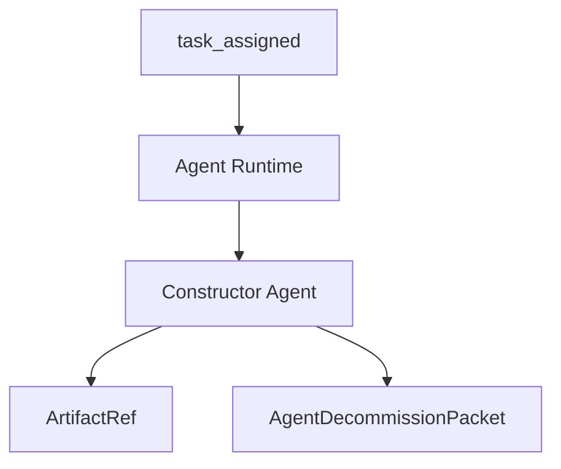
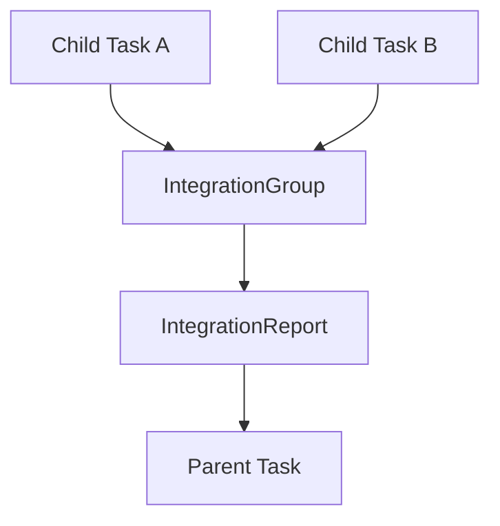
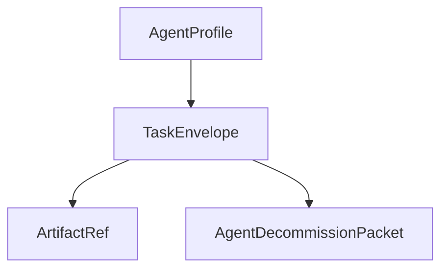
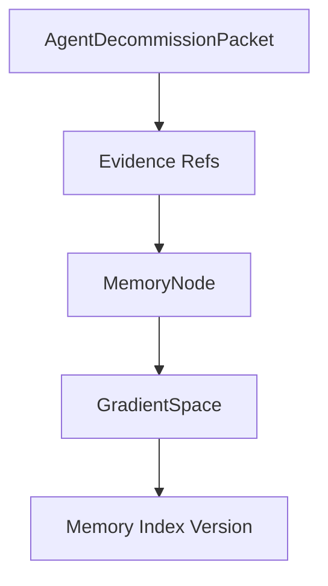
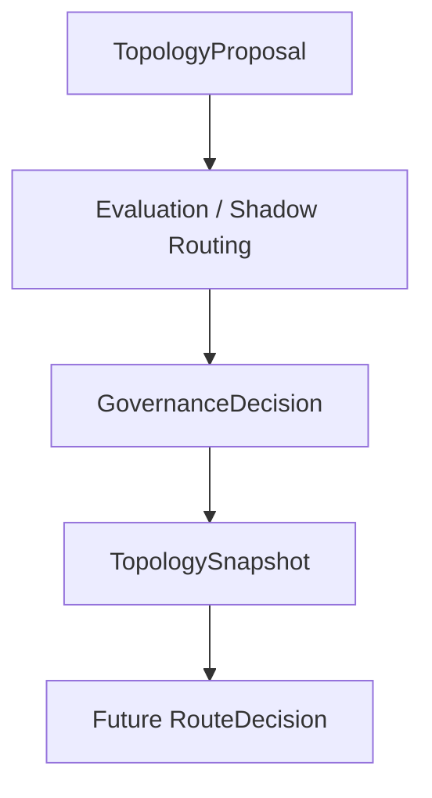

# Lifecycle Flows

**Status:** Draft lifecycle traces
**Date:** 2026-06-13
**Scope:** Ordered traces and diagram guidance for the local Task Loom MVP.

## 1. Purpose

This document explains how the system moves from an input prompt to routed work, artifacts, integration, decommission, memory curation, and topology updates. Each flow is written as an ordered trace with emitted events so the first simulator can implement the same behavior without hidden state.

The flows are intentionally local-first. Real LLM workers, remote providers, and cluster dispatch can be added after the single-process Task Loom can replay these paths.

## 2. Flow Conventions

Each flow includes:

- **Trigger:** What starts the flow.
- **Ordered trace:** The required sequence of steps.
- **Emitted events:** The event vocabulary entries the flow must write.
- **Replay requirement:** What must be reconstructable from the event log.
- **Diagram projection:** Which diagram the flow should support.

## 3. Root Prompt Flow

The root prompt flow starts a Task Loom run.

**Trigger:** A user or upstream system submits a prompt.

**Ordered trace:**

1. The Agent Task Loom receives the prompt.
2. The prompt is assigned a `prompt_id`.
3. The loom creates a root `TaskEnvelope`.
4. The loom records prompt content by hash and reference.
5. The root task is marked ready for decomposition.
6. Observability can now project the beginning of the task graph.

**Emitted events:**

```text
task_created
```

**Replay requirement:** Replay must reconstruct the root prompt reference, root task ID, and initial task envelope without needing to run any agent.

**Diagram projection:** Task dependency diagram starts with `Prompt -> root TaskEnvelope`.



## 4. Task Decomposition Flow

The task decomposition flow turns a root or parent task into child tasks.

**Trigger:** A root task or blocked parent task requires splitting.

**Ordered trace:**

1. The loom selects or assigns a Director Agent.
2. The Director Agent reads the parent `TaskEnvelope`.
3. The Director Agent emits a `PlanNode`.
4. The Director Agent creates child `TaskEnvelope` records.
5. The loom creates an `IntegrationGroup` for the decomposition.
6. Each child task records parent task, root task, prompt, plan, and integration group.
7. The child tasks become routable.

**Emitted events:**

```text
task_created
integration_requested
```

`integration_requested` may be emitted immediately for streaming or monitoring joins, or later when child task readiness satisfies the join policy.

**Replay requirement:** Replay must rebuild the parent-child task graph, plan lineage, dependency edges, and integration group.

**Diagram projection:** Task dependency diagram and decomposition diagram.



## 5. Route-Decision Flow

The route-decision flow turns a routable task into a ranked candidate decision.

**Trigger:** A task enters `routable` state.

**Ordered trace:**

1. The loom builds a `RouteRequest` from the task vector, route policy, topology snapshot, candidate registry, and live-state snapshot.
2. Q-TOM validates request shape, `k`, dimensions, state lengths, and backend support.
3. Q-TOM applies hard constraints as exact masks.
4. Q-TOM scores the candidate set.
5. Q-TOM returns available top-k candidates.
6. Q-TOM records observed top-k debug telemetry when enabled.
7. Q-TOM records substitute quality, fallback status, and ideal-unavailable status.
8. The loom records the route decision and may assign the selected candidate.

**Emitted events:**

```text
route_decision_recorded
task_assigned
```

**Replay requirement:** Replay must know route policy, topology snapshot, backend, candidate set, live-state snapshot, selected candidate, and whether the ideal candidate was unavailable.

**Diagram projection:** Route trace diagram.



## 6. Constructor Execution Flow

The constructor execution flow runs assigned work and produces deliverables.

**Trigger:** The loom emits `task_assigned`.

**Ordered trace:**

1. Agent Runtime receives task assignment.
2. Runtime hydrates prompt, constraints, input artifacts, tool bindings, and memory set.
3. Runtime starts the assigned Constructor Agent profile.
4. Constructor declares expected artifacts when possible.
5. Constructor produces artifact content.
6. Runtime validates artifact shape and content hash.
7. Runtime marks artifacts ready.
8. Runtime marks task completed or blocked.
9. Runtime emits decommission evidence.

**Emitted events:**

```text
artifact_declared
artifact_ready
signal_emitted
task_blocked
task_completed
agent_decommissioned
```

**Replay requirement:** Replay must reconstruct which agent profile executed the task, which artifacts were declared, which artifacts became ready, and what evidence packet was emitted.

**Diagram projection:** Agent handoff and artifact provenance diagrams.



## 7. Integration Flow

The integration flow joins completed child task outputs into coherent artifacts.

**Trigger:** An integration group reaches its join policy condition or times out.

**Ordered trace:**

1. The loom evaluates the `IntegrationGroup` join policy.
2. The loom emits `integration_requested`.
3. An Integration Agent reads child task statuses and artifact refs.
4. The Integration Agent validates included and excluded task outputs.
5. The Integration Agent reconciles conflicts and identifies gaps.
6. The Integration Agent emits an `IntegrationReport`.
7. If gaps remain, the loom creates repair tasks.
8. If accepted, final artifact refs are linked to the parent task.

**Emitted events:**

```text
integration_requested
task_created
artifact_declared
artifact_ready
task_completed
```

**Replay requirement:** Replay must reconstruct included tasks, excluded tasks, conflict edges, gap edges, repair tasks, final artifacts, and acceptance status.

**Diagram projection:** Integration group diagram.



## 8. Decommission Flow

The decommission flow converts execution completion into durable evidence.

**Trigger:** An agent finishes, fails, or is retired from a task.

**Ordered trace:**

1. Agent Runtime gathers deliverable refs, conversation log refs, tool trace refs, telemetry refs, validation refs, failure refs, and open question refs.
2. Runtime creates an `AgentDecommissionPacket`.
3. Runtime emits `agent_decommissioned`.
4. The Task Loom links the packet to the task.
5. Curator Agents become eligible to ingest the packet.
6. Observability can project execution evidence lineage.

**Emitted events:**

```text
agent_decommissioned
```

**Replay requirement:** Replay must preserve enough packet references to audit what happened without requiring every log byte inline.

**Diagram projection:** Decommission lineage diagram.



## 9. Memory Curation Flow

The memory curation flow turns raw evidence into compact reusable memory.

**Trigger:** A Curator Agent ingests a decommission packet or artifact evidence.

**Ordered trace:**

1. Curator Agent reads the `AgentDecommissionPacket`.
2. Curator Agent selects evidence spans and artifact refs.
3. Curator Agent derives typed `MemoryNode` records.
4. Curator Agent proposes or applies placement in a versioned `GradientSpace`.
5. The memory index records the new placement.
6. The index emits an update.
7. Future route requests can use the memory node as part of a candidate set.

**Emitted events:**

```text
memory_node_created
index_updated
```

**Replay requirement:** Replay must reconstruct memory node source evidence, placement version, confidence, and index version used for future retrieval.

**Diagram projection:** Memory lineage diagram.



## 10. Topology-Update Flow

The topology-update flow turns proposed topology changes into committed snapshots.

**Trigger:** Evaluation, curation, an operator, or governance proposes a topology change.

**Ordered trace:**

1. A `TopologyProposal` is created with evidence refs.
2. Governance checks proposal shape and hard-constraint impact.
3. Evaluation runs benchmarks or route comparisons.
4. Shadow routing compares the proposal against the active topology.
5. Canary routing may send limited live traffic to the proposed topology.
6. Governance approves, rejects, or supersedes the proposal.
7. Approved proposals become immutable `TopologySnapshot` records.
8. Q-TOM and candidate providers can use the new snapshot for future route decisions.

**Emitted events:**

```text
topology_proposed
topology_committed
index_updated
```

**Replay requirement:** Replay must know which topology snapshot each route decision used. A new topology snapshot cannot rewrite old decisions.

**Diagram projection:** Topology governance diagram.



## 11. End-To-End MVP Trace

The first local simulator should be able to emit this complete ordered trace:

```text
task_created                root task
task_created                child task A
task_created                child task B
route_decision_recorded     child task A
task_assigned               child task A
artifact_declared           child task A
artifact_ready              child task A
task_completed              child task A
agent_decommissioned        child task A
route_decision_recorded     child task B
task_assigned               child task B
artifact_declared           child task B
artifact_ready              child task B
task_completed              child task B
agent_decommissioned        child task B
integration_requested       parent integration group
artifact_declared           integrated artifact
artifact_ready              integrated artifact
task_completed              parent task
memory_node_created         from child task A packet
memory_node_created         from child task B packet
index_updated               memory index version
```

That trace is enough to prove the initial Split, Build, Join, Remember loop without real LLM execution.

## 12. Diagram Requirements

The event log should support these diagram projections:

- Task dependency diagram.
- Route trace diagram.
- Agent handoff diagram.
- Artifact provenance diagram.
- Integration group diagram.
- Decommission lineage diagram.
- Memory lineage diagram.
- Topology governance diagram.

Diagram generation should be a projection over stored events and entity references. It should not require hidden in-memory state from a prior run.

## 13. Open Flow Questions

- Should route requests be emitted as first-class events or represented only inside `route_decision_recorded` payloads?
- Should `task_failed` be split out before the simulator, or is `task_completed` with a failure status enough for MVP?
- Should Integration Agents produce decommission packets like Constructor Agents?
- Should topology shadow and canary routing events be formalized before the first governance implementation?
- Which flow should be implemented first in code: root prompt to mock task graph, or route-decision capture?
